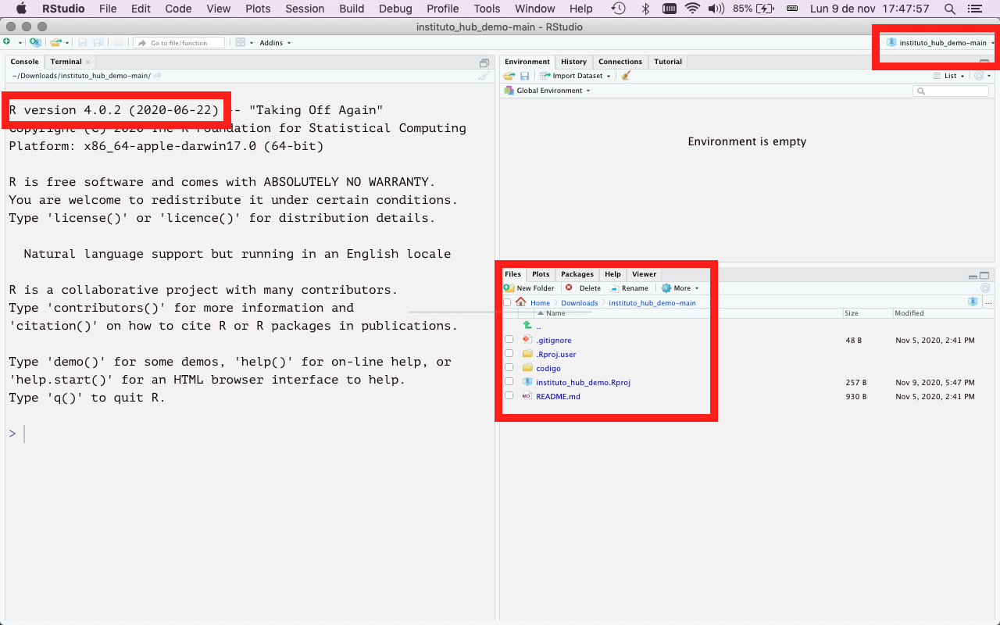

```{r setup, include=FALSE}
knitr::opts_chunk$set(echo = FALSE)
```

# Instruções de instalação

Antes da oficina, recomendamos que você instale R e RStudio.  

## Download e instalação de R

+ Se você está em um computador com Windows: [https://cran.r-project.org/bin/windows/base/release.htm](https://cran.r-project.org/bin/windows/base/release.htm)
+ Em um Mac faça download deste arquivo: [https://cran.r-project.org/bin/macosx/R-latest.pkg](https://cran.r-project.org/bin/macosx/R-latest.pkg)
+ Em Linux faça download dos arquivos binários: [https://cran.r-project.org/index.html](https://cran.r-project.org/index.html) ou execute `sudo apt-get install r-base` em um sistema Debian/Ubuntu.

## Download e instalação de RStudio

Faça download e instale RStudio desde [https://www.rstudio.com/products/rstudio/download/#download](https://www.rstudio.com/products/rstudio/download/#download). Buque a versão mais adequada para seu sistema operativo (Windows, Mac ou Linux).


# _Download_ do material da oficina

A página [https://github.com/liibre/instituto_hub_demo](https://github.com/liibre/instituto_hub_demo) tem um repositório de exemplo para que você trabalhe durante a oficina. Faça download do arquivo ZIP com este projeto clicando neste link [https://github.com/liibre/instituto_hub_demo/archive/main.zip](https://github.com/liibre/instituto_hub_demo/archive/main.zip).

Deszipe o arquivo .zip e entre no folder. Abra o projeto fazendo click em __instituto_hub_demo.Rproj__

Se o RStudio abrir e você conseguir ver o projeto aberto na esquina superior direita da janela de RStudio, está pronta para participar :) 

```{r, rstudio}
library(knitr)

```

## RStudio Cloud

Se você tiver problemas para instalar R ou RStudio no seu computador, acesse o seguinte [link](https://rstudio.cloud/project/1878325) e siga as instruções para criar uma conta em [RStudio Cloud](https://rstudio.cloud/). 

Nota: este serviço tem capacidade limitada de processamento. Procure utilizar esta opção apenas se não conseguir realizar a instalação local. 
