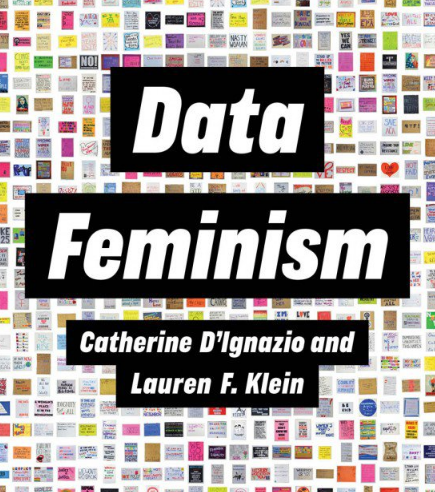
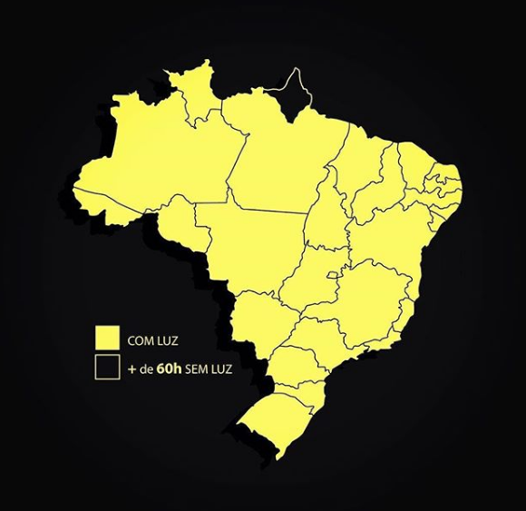
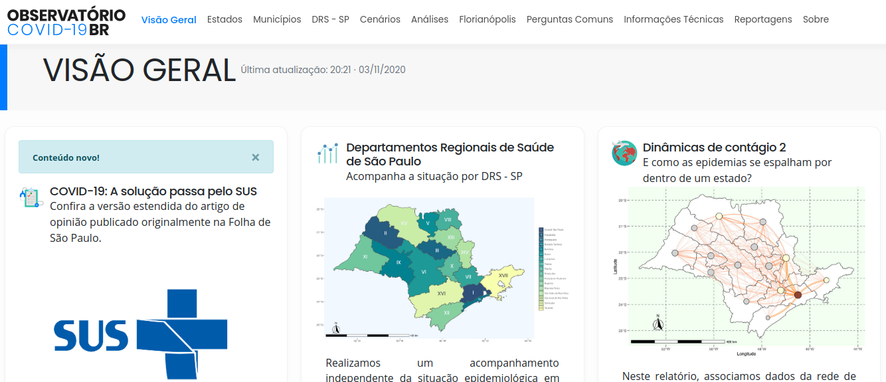
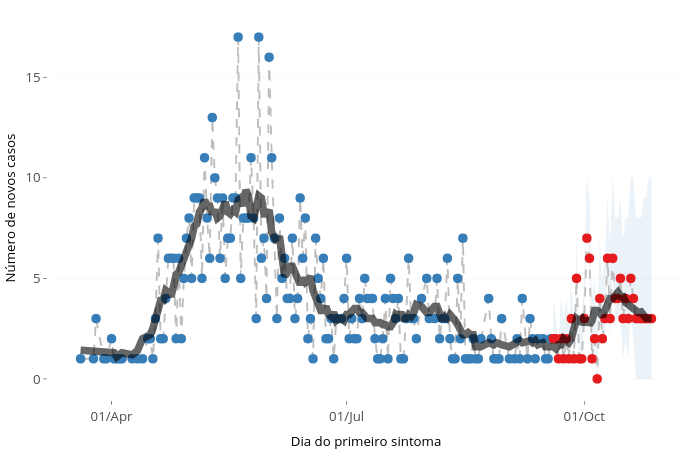

```{r setup, include = FALSE, purl = FALSE}
options(htmltools.dir.version = FALSE, cache = TRUE)

```

```{css, echo = FALSE, purl = FALSE}
.tiny .remark-code { /*Change made here*/
  font-size: 60% !important;
}
```

```{r xaringanthemer, include = FALSE, purl = FALSE}
library(knitr)
library(xaringanthemer)
library(xaringanExtra)
xaringanthemer::style_mono_accent(
  base_color = "#A70000",
  #  primary_color = "#A70000",
  #secondary_color = "#ff0000",
  white_color = "white",
  colors = c(
    red = "#A70000",
    purple = "#88398a",
    orange = "#ff8811",
    green = "#136f63",
    blue = "#4B4FFF",
    white = "#FFFFFF",
    black = "#181818"
  ),
  header_font_google = google_font("Roboto Condensed"),
  text_font_google   = google_font("Roboto Condensed", "300", "300i"),
  code_font_google   = google_font("Ubuntu Mono"),
  text_font_size = "30px",
  code_font_size = "30px",
  )
```

```{r xaringanExtra-clipboard, echo=FALSE, purl = FALSE}
htmltools::tagList(
  xaringanExtra::use_clipboard(
    button_text = "<i class=\"fa fa-clipboard\"></i>",
    success_text = "<i class=\"fa fa-check\" style=\"color: #90BE6D\"></i>",
    error_text = "<i class=\"fa fa-times-circle\" style=\"color: #F94144\"></i>"
  ),
  rmarkdown::html_dependency_font_awesome()
)
```
## apresentação

```{r logo-liibre, echo = FALSE, purl = FALSE}

xaringanExtra::use_logo(image_url = "https://raw.githubusercontent.com/liibre/logo/master/figures/logo_liibre.png", width = 150)
#knitr::include_graphics("https://raw.githubusercontent.com/liibre/logo/master/figures/logo_liibre.png?token=AA75IFQA34SCCZB72UL5IXK7UWDYA")
```


- __Andrea Sánchez-Tapia__ Bióloga (UNAL - Colômbia), MSc. Ecologia (UFRJ), Dra. em Botânica (ENBT-JBRJ). Usuária de R desde 2009. Ecologia quantitativa, Informática da biodiversidade, Ecologia de comunidades, Ciência de dados feminista
--

- __Sara Ribeiro Mortara__
Bióloga (ESALQ/USP), MSc. Ecologia e Conservação da Biodiversidade (UESC) e Dra. em Ecologia (USP). Usuária de R desde 2009. Modelagem estatística, Ecologia & Ciência de dados feminista
--

- __¡liibre!__ se propõe a criar um ambiente de ensino e aprendizagem de habilidades computacionais a partir de uma perspectiva de ciência de dados feminista, responsável, aberta e para todes

---
## projetos

- pacotes [coronabr](https://liibre.github.io/coronabr/about.html) , [modleR](https://model-r.github.io/modleR/]modleR), [Rocc](https://github.com/liibre/rocc), [dados](https://github.com/cienciadedatos/dados)

- curso de _Projetos de análise de dados usando R_ no Jardim Botânico do Rio de Janeiro

- [**Observatório COVID-19 BR**](https://covid19br.github.io/)

- Capítulo de RLadies+ Rio de Janeiro [**.purple[@RLadiesRio]**](https://twitter.com/RLadiesRio)


```{r logo-rladiesplus, out.width=150, fig.align ='right', echo = FALSE, purl = FALSE}
knitr::include_graphics("https://raw.githubusercontent.com/rladies/starter-kit/master/stickers/rainbow-inclusive.png")
```

---

## sobre hoje

1. conhecendo a linguagem R e fluxo de trabalho

2. introdução ao R

3. manipulação de dados

4. criando figuras básicas

---

## códigos de apoio

todos os códigos diponíveis em: 

`r icon::fa("github")` https://github.com/liibre/instituto_hub_demo


`r icon::fa("r-project")`  https://rstudio.cloud/project/1878325

---
## antes de começar

+ procure a janela de chat do zoom, e não hesite em fazer perguntas

--

+ tem um botão verde para contar se tudo está certo. Periodicamente vamos perguntar se todo mundo está acompanhando, por favor use este botão ou responda no chat

--

+ pode abrir sua câmera :) procure manter seu microfone silenciado. 

---
class: inverse, middle, center

# 1. conhecendo a linguagem R e fluxo de trabalho


---
## por que R?

- linguagem de __código aberto__, __livre__ & __sem custo__: um dos pilares da ciência aberta

--

- __baseada em scripts__: essencial para reprodutibilidade, facilidade para ampliar a escala, transparência, correção/robusteza 

--

- acessível (em comparação a outras linguagens de programação)

--

- muito comum na Biologia, Ciência de Dados e outras áreas. A escolha para quem precisa fazer analises estatísticas

--

+ __interdisciplinar e modular__: muitos pacotes são escritos por especialistas 

--

+ uma filosofia de passar facilmente do uso à  programação

---
## por que R?

+ ferramentas para __comunicar os resultados__: manuscritos, presentações, _apps_

--

+ comunicação com otras linguagens de programação (ex. python e __reticulate__) 

--

+ ótima capacidade gráfica 

--

+ __suporte oficial__: documentação, vignettes, listas de email

--

+ __suporte não oficial__: uma comunidade ativa: listas de email, grupos de usuáries (useR), capítulos de .purple[R-Ladies+], comunidade de  [RStudio](community.rstudio.com/), 
Stack Overflow, `r icon::fa("twitter")` `#rstats`

```{r rladies+, out.width=150, echo = FALSE, purl = FALSE}
knitr::include_graphics("https://raw.githubusercontent.com/rladies/starter-kit/master/stickers/rainbow-inclusive.png")
```

---
## `R` tem uma estrutura modular: __pacotes__
--

+ a instalação de base de `R` inclui pacotes mantidos pelo __`R` Core Development Team__

--

+ repositório oficial de pacotes: __CRAN__ (The Comprehensive `R` Archive Network [https://cran.r-project.org/](https://cran.r-project.org/)) or Bioconductor, GitHub, rOpenSci.org

--

+ pacotes fora da instalação de base precisam ser __instalados__ e __carregados__

--

+ os pacotes são coleções de __funções__ 

--

+ as funções têm __opções__: "parâmetros", "argumentos"

--

+ vamos manter a convenção `nome_da_funcao()` e `pacote::nome_da_funcao()` quando for preciso especificar o pacote ao qual a função pertence. 

---
background-image:url("figs/rstudio.png")
background-size: 60%
background-position: 50% 90%

## rodando R em RStudio

+ descompacte o arquivo .zip, entre na pasta e clique em __instituto_hub_demo.Rproj__

`r icon::fa("laptop-code", size = 3)`

---
## RStudio 

+ tela separada em três paineis. criar um __script__ abre o quarto painel. 

+ podemos executar código no console mas vamos usar o __script__ para guardar os passos. 

+ escrever no script e clicar `control + enter` para mandar o conteúdo para o console.

+ outras abas: help, environment, plots, files... 

<!-- aqui NO! crear objetos, mostrar environment, mostrar ls() y mostrar el help y parar en files -->

---
class: inverse, middle, center
## configuração e organização de projetos 

---
## pasta de trabalho

+ R tem que saber __em que pasta você está trabalhando__, para poder buscar os arquivos que você quer ler, e saber onde guardar os resultados de suas análises: __working directory__: pasta de trabalho

--

+ para saber onde você está: `getwd()`

--

+ você pode mudar esta localização usando `setwd()` mas não é recomendado (erros!) [Jenny Bryan](https://www.tidyverse.org/blog/2017/12/workflow-vs-script/)

--

+ melhor: em vez de abrir RStudio e trocar a pasta, abrir um script de R (extensão `.R`) ou um projeto de __RStudio project__ (extensão `.Rproj`) __já na pasta onde você vai trabalhar__. (Igual ao que você faria abrindo um arquivo `r icon::fa("file-word")`)

---
## organização de projetos e Boas Práticas

+ cada projeto de análise de dados deveria estar em __uma única pasta__

--

+ __subpastas__ para organizar o conteúdo.

--

+ em vez de usar __caminhos absolutos__ é melhor usar __caminhos relativos__
  + evite `C://usuario/seu_nome/suas_pastas/seu_projeto` -> caminho absoluto
  + `.` "aqui" (o resultado de `getwd()`)
  + `./subpastas` (ex. `/figs`)
  + o nível acima `..`
  
--

+ os __dados originais__ não devem ser modificados. qualquer modificação deve ser salva à parte, junto com os scripts que fizeram a modificação.

---
## o projeto atual

```
 ./instituto_hub_demo/
 ├── README.md
 ├── codigo
 ├── dados
 │   ├── brutos
 │   └── processados
 ├── figs
 └── instituto_hub_demo.Rproj
```

<center>
`r icon::fa("laptop-code", size = 3)`
</center>

---
## os projetos de RStudio

+ arquivos __opcionais__, com extensão __.Rproj__ para abrir a sessão de R no local correto

--

+ um projeto de RStudio pode ser criado clicando no canto superior direito (`Project: none > New project`)

---
class: inverse, middle, center

## introdução a R

`r icon::fa("laptop-code", size = 3)`

---
## criação de objetos

+ executar no script ou no console -> não cria nada

--

+ `<-` - para atribuição a objetos

--

+ cria dentro do espaço de trabalho "__workspace__", aba __Environment__ de RStudio

--

+ pode explorar o conteúdo com `ls()` (listar)

--

+ quando você cria objetos eles ocupam memória RAM do computador

--

+ o __workspace__ pode ser salvo e carregado entre sessões mas não é recomendável fazer isto `#boaspráticas`

--

  + você pode perder controle de como foram criados os objetos
  + pode guardar objetos com erros e isto pode interferir no seu trabalho

---
## criação de objetos


+ confiar no __script__ para recriar todos os objetos (__reprodutibilidade!__)

--

+ guardar os objetos importantes como __tabelas__, __figuras__, ou objetos individuais de R (`.rda` ou `.rdata`)

--

+ um script deve ler ou criar objetos no início e salvar resultados no final

--

+ é bom criar diferentes __scripts sucessivos__ para manter a ordem

---
background-image:url("figs/0a_setup.png")
background-size: 60%
background-position: 60% 100%

.pull-left[
#### nas opções gerais
]


---
class: inverse, middle, center

# 2. introdução ao R


---
## tipos de dados em R

+ R entende dados __numéricos__ (_numeric_, e _integer_ para números inteiros), de __texto__ (_character_), valores lógicos (`TRUE/FALSE`), entre outros.

<small>

```{r vetores}
populacao <- c(1500, 2000) 
estados <- c("Acre", "Alagoas", "Amapá", "Amazonas", "Tocantins")
class(populacao)
class(estados)
```
</small>

---
## tipos de dados em R

<small>

```{r vetores2}
verdadeiro_falso <- c(FALSE, TRUE)
verdadeiro_falso
class(verdadeiro_falso)
posicao <- c(1L, 2L)
posicao
class(posicao)
```
</small>

---
## vetores

+ `c()` para criar - "concatenar"

```{r str_length}
str(estados) #estrutura
length(estados)
```

---
## selecionando elementos de vetores (_subsetting_)

+ entre __colchetes__ `[]`
+ com vetores de __posição__ ou vetores __lógicos__ (`TRUE/FALSE`)


<small>
```{r subsetting, results = "hide"}
estados <- c("Acre", "Alagoas", "Amapá", "Amazonas", "Tocantins")
estados[1]
estados[c(TRUE, FALSE, TRUE, FALSE)]
estados[1:2]
estados[1:4]
#estados[ 1,3,5] #NAO! a vírgula marca dimensões
estados[c(1,3,5)] #tem que ser um vetor
```
</small>

---
## subsetting com cláusulas lógicas 

```{r logical_clauses, results="hide"}
casos <- c(150, 200, 400, 500, 500, 600)
casos > 150
casos[casos > 150]
casos >= 150 # superior ou igual
casos < 300
casos == 200
casos != 200
```

---
## operadores lógicos

.pull-left[
+ igualdade: `==`
+ diferença: `!=` (`!` em geral é negação)
+ desigualdades: `<`. `>`, `<=`, `>=`
+ união (OR/OU): `|`
+ interseção (AND): `&`
+ pertenecimento: `%in%`
+ _não_ pertenecimento: `!a %in% b`
]

.pull-right[
+ `casos == 200`
+ `casos != 200`
+ `casos < 300`, `casos >= 150`
+ `casos < 200 | casos > 500`
+ `casos > 200 & casos < 500`
+ `casos %in% c(100, 200, 300)`
+ `!casos %in% c(400)`
]

O operador lógico cria um __vetor lógico__, a seleção vai entre colchetes:

```{r}
casos[casos > 150]
```

---
##  criando vetores numéricos

```{r outras, results="hide"}
1:10
seq(1, 10, 2)
rep(1:4, 2)
rep(1:4, each = 2)
unique(casos)
```


---
## estruturas de dados em `R`

+ __vetor__: lineal, uma dimensão só: `length()`

--

+ __fatores__: vetores  que representam __variáveis categóricas__ e portanto têm níveis (__levels()__) `factor(estados)`

--

+ __matrizes__: arranjos de duas dimensões de __dados do mesmo tipo__ (`dim()`, `nrow()`, `ncol()`). 

--

+ __listas__: literalmente listas de qualquer outro objeto (inclusive listas) 

--

+ __data frames__: arranjos bi-dimensionais de dados de diferentes tipos (i.e., uma coluna numérica, outra com nomes, outra com um fator etc.)

---
## data frames 

+ Duas dimensões (linhas e colunas): `dim()`, `ncol()`, `nrow()`

--

+ Podem ser diferentes tipos de dado
--


+ Uma versão recente(__*__) de `data.frame`: o `tibble`

.foot-note[você vai ouvir falar do __tidyverse__]


---
## instalando pacotes

```{r pacotes, eval = F}
# Para instalar pacotes desde CRAN
install.packages("remotes")

# Para instalar coronabr desde GitHub
remotes::install_github("liibre/coronabr")

# Para carregar pacotes
library(coronabr)

# Para buscar ajuda
?coronabr
```

---
## funções, argumentos e entendendo a ajuda

.pull-left[
```
help(funcao)
?funcao
??palavra_chave
args(funcao)
```
]

.pull-right[
```r
help("get_corona_br")
?get_corona_br
??corona
args(get_corona_br)
```
]

+ ou selecionar o nome da função e clicar __F1__

+ No __help__ estão os argumentos na ordem correta, e os valores padrão (por _default_) estão indicados. Se a gente não especificasse a função usaria esses valores.  

---
## download dos dados para Amapá

```{r coronabr, echo = TRUE}
library(coronabr)
```

```{r download, echo = FALSE}
# colocando aqui para nao fazer o download toda vez :P
amapa <- read.csv("dados/brutos/01-amapa.csv", stringsAsFactors = FALSE)
amapa$date <- as.Date(amapa$date)
amapa$last_available_date <- as.Date(amapa$last_available_date)
```


```{r get_corona_br, eval = FALSE}
caminho <- "dados/brutos"
amapa <- get_corona_br(dir = "caminho", filename = "01-amapa", uf = "AP")

amapa_df <- data.frame(amapa)
```

---
## inspecionar objetos `data.frame`

```{r try, echo = TRUE, eval = FALSE}
names(amapa)
dim(amapa)
nrow(amapa)
ncol(amapa)
head(amapa) # 6 linhas por padrão
tail(amapa)
rownames(amapa)
length(amapa) # numero de colunas
summary(amapa) # quantis e a média 
```

---
## selecionar colunas e filtrar linhas

+ entre colchetes também mas __as dimensões separadas por uma vírgula__

`amapa[linhas, colunas]`

```{r}
amapa[, 1:3] #três primeiras colunas
amapa[4, 13] #quarto elemento da coluna 13

```


---
class: inverse, middle, center

# 3. manipulação de dados

---
## estrutura de tabelas

- cada __variável__ uma coluna 

- cada __observação__ uma linha

- estado da variável --> __valor __

- em geral em `data.frame` ou `tibble`

---
## tidy data 


.pull-left[
- dados são inerentemente confusos


- dados precisam ser organizados e domados


- organizados e domados para quem?

- ideia de que os dados devem ser limpos e controlados tem raízes históricas

]

.pull-right[
```{r echo = FALSE}
include_graphics("https://www.measureevaluation.org/resources/newsroom/news-images/tidy-data/image")
```
]

---
## responsabilidade com os dados

.pull-left[
- parcialidade

- transparência

- co-liberação

- pluralismo
]

.pull-right[
```{r, echo = FALSE, out.width=300}

```
]

---
## dados de COVID-19: responsabilidade & contexto

- dados deveriam ser abertos e acessíveis
  
  [Transparência COVID-19 OPEN KNOWLEDGE BRASIL](https://transparenciacovid19.ok.org.br)
  
  
- nem toda análise que **pode** ser feita, **deve** ser feita 


- cada dado diz respeito a uma pessoa


- para COVID-19 e SRAG: **subnotificação** & **atraso**


- inconsistência com dados reportados em diferentes escalas: município, estado, país


---
## lendo os dados

.tiny[
```{r}
amapa <- read.csv("dados/brutos/01-amapa.csv")
head(amapa[c(3, 4, 9:18)])
```
]
---
## municipios do Amapá

```{r}
unique(amapa$city)

```

---
## dados de municípios & do estado

```{r}
table(amapa$place_type)

unique(amapa$place_type[is.na(amapa$city)])
```

---
## a classe data

```{r}
class(amapa$date)
class(amapa$last_available_date)
```

---
## convertendo para a classe data

```{r}
amapa$date <- as.Date(amapa$date)
amapa$last_available_date <- as.Date(amapa$last_available_date)

class(amapa$date)

range(amapa$date)
```

---
# usando a função `aggregate()` 

.tiny[
```{r}
acu <- aggregate(last_available_confirmed ~ city, FUN = max, data = amapa)
acu

```
]


---
## um gráfico de barras

.tiny[
```{r fig.align='center'}
barplot(acu[, 2], names.arg = acu[, 1])
```
]

---
## ordenando o objeto

.tiny[
```{r}
acu.or <- acu[order(acu$last_available_confirmed), ]
acu.or
```
]

---
## novamente, o gráfico de barras

.tiny[
barplot(acu.or[, 2], names.arg = acu.or[, 1], las = 2)
```
]

---
## selecionando partes do dado

```{r}
estado <- amapa[amapa$place_type == "state", c(-15)]
dim(estado)
```


---
## mesma tarefa, de outra forma

```{r}
# outra forma: onde a coluna city é NA
estado2 <- amapa[is.na(amapa$city), c(-15)]
## as duas formas tem o mesmo resultado:
all.equal(estado2, estado)
```

---
## apenas o município de Macapá

```{r}
# dados apenas de Macapa por meio do geocode do IBGE
macapa <- amapa[amapa$city_ibge_code == "1600303", c(-15)]
```


---
## para exportar os dados

```{r}
if (!dir.exists("dados/processados/")) {
  dir.create("dados/processados/")
}

# Escrevendo os dados
write.csv(estado, 
          "dados/processados/02-estado_AP.csv",
          row.names = FALSE)

write.csv(macapa, 
          "dados/processados/02-municipio_Macapa.csv", 
          row.names = FALSE)
```

---
## casos novos no Macapá

```{r, eval = FALSE}
plot(last_available_confirmed ~ date, data = macapa)
lines(last_available_confirmed ~ date, data = macapa)
```

---
## casos novos no Macapá

```{r, echo = FALSE, fig.align='center'}
plot(last_available_confirmed ~ date, data = macapa)
lines(last_available_confirmed ~ date, data = macapa)
```


---
## apagão

```{r, fig.align='center', out.width=400, echo = FALSE}

```

`r icon::fa("instagram")` @designativista


---
## novos casos no estado do Amapá

```{r eval = FALSE}
# para o estado todo
plot(last_available_confirmed ~ date, data = estado,
     xlab = "Data de notificação", ylab = "Casos acumulados")
lines(last_available_confirmed ~ date, data = estado)
```

---
## novos casos no estado do Amapá

```{r echo = FALSE, fig.align='center'}
# para o estado todo
plot(last_available_confirmed ~ date, data = estado,
     xlab = "Data de notificação", ylab = "Casos acumulados")
lines(last_available_confirmed ~ date, data = estado)
```

---
## estado & município

```{r eval = FALSE}
# para o estado todo
plot(last_available_confirmed ~ date, data = estado,
     xlab = "Data de notificação", ylab = "Casos acumulados")
lines(last_available_confirmed ~ date, data = estado)
# linhas e pontos do municipio Macapa
lines(last_available_confirmed ~ date, data = macapa, col = "red")
points(last_available_confirmed ~ date, data = macapa, col = "red")
# legenda
legend("topleft", c("estado AP", "município Macapá"), 
       pch = 1, col = c("black", "red"))

```

---
## estado & município

```{r echo = FALSE, fig.align='center'}
# para o estado todo
plot(last_available_confirmed ~ date, data = estado,
     xlab = "Data de notificação", ylab = "Casos acumulados")
lines(last_available_confirmed ~ date, data = estado)
lines(last_available_confirmed ~ date, data = macapa, col = "red")
points(last_available_confirmed ~ date, data = macapa, col = "red")
legend("topleft", c("estado AP", "município Macapá"), 
       pch = 1, col = c("black", "red"))

```

---
## gráfico de dispersão

```{r eval = FALSE}
plot(x = amapa$estimated_population, 
     y = amapa$last_available_confirmed)
```

---
## gráfico de dispersão

```{r echo = FALSE, fig.align='center'}
plot(x = amapa$estimated_population, 
     y = amapa$last_available_confirmed)
```

---
## boxplot

```{r eval = FALSE}
boxplot(last_available_death_rate ~ city, 
        data = amapa)
```

---
## boxplot

```{r echo = FALSE, fig.align='center'}
boxplot(last_available_death_rate ~ city, 
        data = amapa)
```

---
## entendendo o boxplot

```{r, echo=FALSE, fig.show='asis', fig.align='center', fig.width=8, fig.height=7}
set.seed(2)
par(bty = "n")
bp <- rnorm(1000, 0, 0.1)
boxplot(bp, yaxt = "n", xlim = c(0, 3), ylim = c(-0.3, 0.3))
text(x = 1.82, y = min(bp), "último ponto (-1,5 x IIQ)", cex = .9)
text(x = 1.72, y = quantile(bp)[2], "primeiro quartil", cex = .9)
text(x = 1.72, y = median(bp), "mediana", cex = .9)
text(x = 1.72, y = quantile(bp)[4], "terceiro quartil", cex = .9)
text(x = 1.82, y = bp[203], "último ponto (+1,5 x IIQ)", cex = .9)
arrows(x0 = 0.68, x1 = 0.68, y0 = quantile(bp)[2], 
       y1 = quantile(bp)[4], code = 3, length = 0.05)
text(x = 0.54, y = median(bp), "IIQ", cex = .9)
```


---
class: inverse, middle, center

# 4. criando figuras básicas

---
## lendo os dados processados

```{r}
# Macapa
macapa <- read.csv("dados/processados/02-municipio_Macapa.csv")
# convertendo para classe data
macapa$date <- as.Date(macapa$date)
```

---
## um gráfico básico

```{r eval=FALSE}
plot(new_confirmed ~ date, data = macapa)
lines(new_confirmed ~ date, data = macapa)
```


---
## um gráfico básico

```{r echo=FALSE, fig.align='center'}
plot(new_confirmed ~ date, data = macapa)
lines(new_confirmed ~ date, data = macapa)
```

---
## um gráfico melhor

```{r eval = FALSE}
# usando a funcao par para controlar parametros
par(bty = "l", las = 1)
# adicionando nome dos eixos
plot(new_confirmed ~ date, data = macapa,
     xlab = "Data",
     ylab = "Casos diários")
lines(new_confirmed ~ date, data = macapa)
```

---
## um gráfico melhor

```{r echo = FALSE, fig.align='center'}
# usando a funcao par para controlar parametros
par(bty = "l", las = 1)
# adicionando nome dos eixos
plot(new_confirmed ~ date, data = macapa,
     xlab = "Data",
     ylab = "Casos diários")
lines(new_confirmed ~ date, data = macapa)
```

---
# para exportar o grafico

```{r eval = FALSE}
png("figs/casos_diarios_Macapa.png", res = 300,
    width = 1200, height = 1200)
par(bty = "l", las = 1)
# adicionando nome dos eixos
plot(new_confirmed ~ date, data = macapa,
     xlab = "Data",
     ylab = "Casos diários")
lines(new_confirmed ~ date, data = macapa)
dev.off()
```

---
## ressalvas em relação aos dados brutos

0.  __apagão__
--


1. __subnotificação__
--


2. __atraso__ na entrada dos dados no sistema - tanto para casos como óbitos
--

---
## como vemos o atraso

```{r gif, echo = FALSE, out.width=500, fig.align='center'}
include_graphics("https://raw.githubusercontent.com/covid19br/covid19br.github.io/master/fig/gif_BE_05_junho.gif")
```

---
## Observatório Covid-19BR

```{r, echo = FALSE, fig.align='center'}

```


---
## correção por nowcasting 

```{r obs-diarios,echo = FALSE, fig.align='center', out.width=700}

```


---
## como começar a usar o R

- um __projeto__, uma __pergunta__, uma __análise__
--


- uma pasta __autocontida__
--

- um `.Rproj`
--


- scripts __modulares__
--


- compartilhar
--


---
## para ter em mente


- pensar no fluxo de trabalho
--


- R: __reprodutibilidade__ e __responsabilidade__
--


- os dados __não __ falam por si só
--


- entender o contexto é essencial para fazer uma boa análise
--


- manter-se __¡liibre!__


---
## Fontes de ajuda 

+ Material de estudo em português [link](https://github.com/beatrizmilz/materiais_estudo_R)
+ [LearnR4Free](https://www.learnr4free.com/) em inglês e em espanhol
+ Disciplina *Projetos de análise de dados usando R* [link](https://github.com/liibre/curso)
+ R Reference Card [PDF](https://cran.r-project.org/doc/contrib/Short-refcard.pdf)
+ Base R cheatsheet [PDF](https://raw.githubusercontent.com/rstudio/cheatsheets/master/base-r.pdf)
+ R Taskviews: listas de pacotes por tema curados por especialistas [link](https://cran.r-project.org/web/views/) 
+ Livro [R for Data Science](https://r4ds.had.co.nz/)
+ Pacote **dados**: os conjuntos de dados de R4DS traduzidos para o português: [GitHub](https://github.com/cienciadedatos/dados)
+ RStudio cheatsheet [PDF](https://raw.githubusercontent.com/rstudio/cheatsheets/master/rstudio-ide.pdf)
+ RStudio Data Import Cheatsheet [PDF](https://raw.githubusercontent.com/rstudio/cheatsheets/master/data-import.pdf)
+ R Bloggers https://www.r-bloggers.com/

---
## Comunidades

+ Latin-R http://bit.ly/latinr-slack 
+ RLadies+ https://rladies.org/
+ Slack da comunidade RLadies+ https://rladies-community-slack.herokuapp.com/
+ YouTube de RLadies+ global https://www.youtube.com/c/RLadiesGlobal
+ Comunidade de RStudio https://community.rstudio.com/
+ Configuração das opções globais de RStudio [link](https://support.rstudio.com/hc/en-us/articles/200549016-Customizing-RStudio)

---

# Obrigada!

<center>
`r icon::fa("paper-plane")` [andreasancheztapia@gmail.com](mailto:andreasancheztapia@gmail.com) [saramortara@gmail.com](mailto:saramortara@gmail.com) 

`r icon::fa("twitter")` [@SanchezTapiaA](https://twitter.com/SanchezTapiaA)  [@MortaraSara](https://twitter.com/MortaraSara) 

`r icon::fa("github")` `r icon::fa("gitlab")` [¡liibre!](http://github.com/liibre)  
